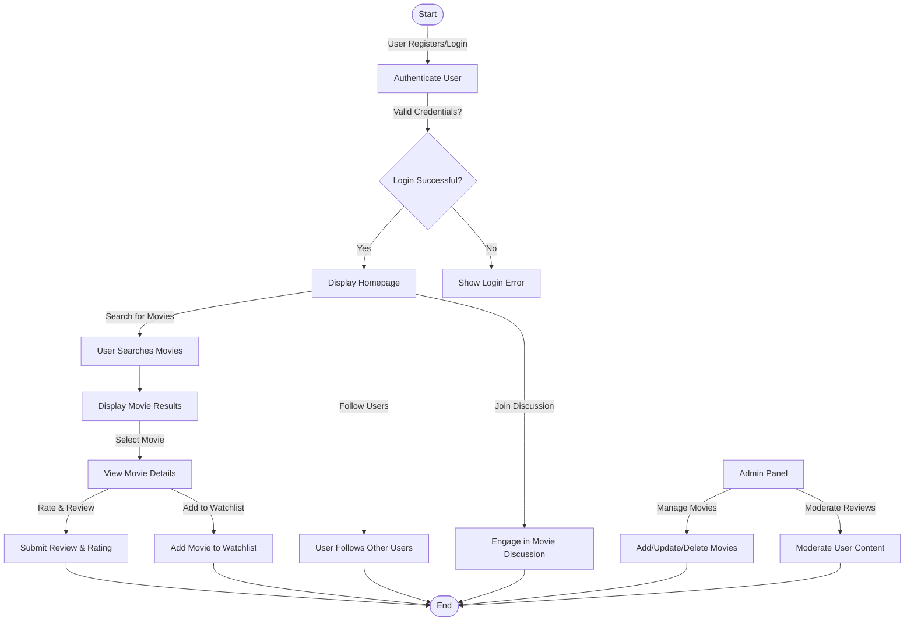

```mermaid
graph TD;
    Start(["Start"]) -->|User Registers/Login| Auth[Authenticate User]
    Auth -->|Valid Credentials?| CheckLogin{Login Successful?}
    CheckLogin -- Yes --> Home[Display Homepage]
    CheckLogin -- No --> Error["Show Login Error"]

    Home -->|Search for Movies| Search[User Searches Movies]
    Search --> DisplayResults[Display Movie Results]
    DisplayResults -->|Select Movie| MovieDetail[View Movie Details]

    MovieDetail -->|Add to Watchlist| Watchlist[Add Movie to Watchlist]
    MovieDetail -->|Rate & Review| Review[Submit Review & Rating]

    Home -->|Follow Users| Follow[User Follows Other Users]
    Home -->|Join Discussion| Discussion[Engage in Movie Discussion]

    AdminPanel[Admin Panel] -->|Manage Movies| ManageMovies[Add/Update/Delete Movies]
    AdminPanel -->|Moderate Reviews| Moderate[Moderate User Content]

    Review & Watchlist & Follow & Discussion --> End(["End"])
    ManageMovies & Moderate --> End
```
