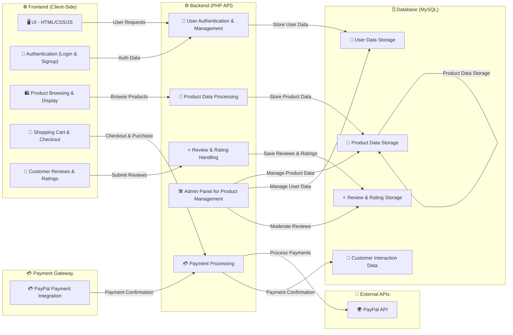

```mermaid
graph LR;

  %% Frontend Section
  subgraph Frontend["🌐 Frontend (Client-Side)"]
    A1["🖥️ UI - HTML/CSS/JS"]
    A2["🔑 Authentication (Login & Signup)"]
    A3["🛍️ Product Browsing & Display"]
    A4["🛒 Shopping Cart & Checkout"]
    A5["💬 Customer Reviews & Ratings"]
  end

  %% Backend Section
  subgraph Backend["⚙️ Backend (PHP API)"]
    B1["🔐 User Authentication & Management"]
    B2["📡 Product Data Processing"]
    B3["⭐ Review & Rating Handling"]
    B4["🛠️ Admin Panel for Product Management"]
    B5["💳 Payment Processing"]
  end

  %% Database Section
  subgraph Database["🗄️ Database (MySQL)"]
    C1["👤 User Data Storage"]
    C2["🧥 Product Data Storage"]
    C3["⭐ Review & Rating Storage"]
    C4["💬 Customer Interaction Data"]
  end

  %% Payment Gateway Section
  subgraph Payment["💳 Payment Gateway"]
    E1["💳 PayPal Payment Integration"]
  end

  %% External API Section
  subgraph ExternalAPIs["🔗 External APIs"]
    D1["🌍 PayPal API"]
  end

  %% Connections Between Components
  A1 -->|User Requests| B1
  A2 -->|Auth Data| B1
  A3 -->|Browse Products| B2
  A4 -->|Checkout & Purchase| B5
  A5 -->|Submit Reviews| B3

  B1 -->|Store User Data| C1
  B2 -->|Store Product Data| C2
  B3 -->|Save Reviews & Ratings| C3
  B4 -->|Manage Product Data| C2
  B4 -->|Manage User Data| C1
  B4 -->|Moderate Reviews| C3
  B5 -->|Process Payments| D1

  B5 -->|Payment Confirmation| C4
  E1 -->|Payment Confirmation| B5
  C2 -->|Product Data Storage| C2

```
