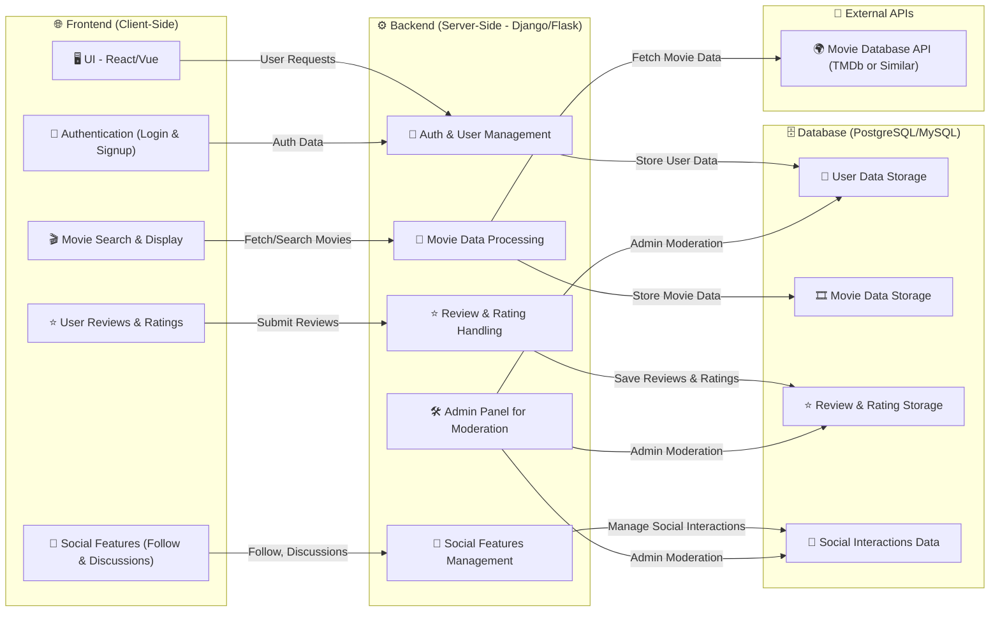

```mermaid
graph LR;

  %% Frontend Section
  subgraph Frontend["🌐 Frontend (Client-Side)"]
    A1["🖥️ UI - React/Vue"]
    A2["🔑 Authentication (Login & Signup)"]
    A3["🎬 Movie Search & Display"]
    A4["⭐ User Reviews & Ratings"]
    A5["💬 Social Features (Follow & Discussions)"]
  end

  %% Backend Section
  subgraph Backend["⚙️ Backend (Server-Side - Django/Flask)"]
    B1["🔐 Auth & User Management"]
    B2["📡 Movie Data Processing"]
    B3["⭐ Review & Rating Handling"]
    B4["💬 Social Features Management"]
    B5["🛠️ Admin Panel for Moderation"]
  end

  %% Database Section
  subgraph Database["🗄️ Database (PostgreSQL/MySQL)"]
    C1["👤 User Data Storage"]
    C2["🎞️ Movie Data Storage"]
    C3["⭐ Review & Rating Storage"]
    C4["💬 Social Interactions Data"]
  end

  %% External API Section
  subgraph ExternalAPIs["🔗 External APIs"]
    D1["🌍 Movie Database API (TMDb or Similar)"]
  end

  %% Connections Between Components
  A1 -->|User Requests| B1
  A2 -->|Auth Data| B1
  A3 -->|Fetch/Search Movies| B2
  A4 -->|Submit Reviews| B3
  A5 -->|Follow, Discussions| B4

  B1 -->|Store User Data| C1
  B2 -->|Store Movie Data| C2
  B3 -->|Save Reviews & Ratings| C3
  B4 -->|Manage Social Interactions| C4

  B2 -->|Fetch Movie Data| D1

  B5 -->|Admin Moderation| C1 & C3 & C4

```
