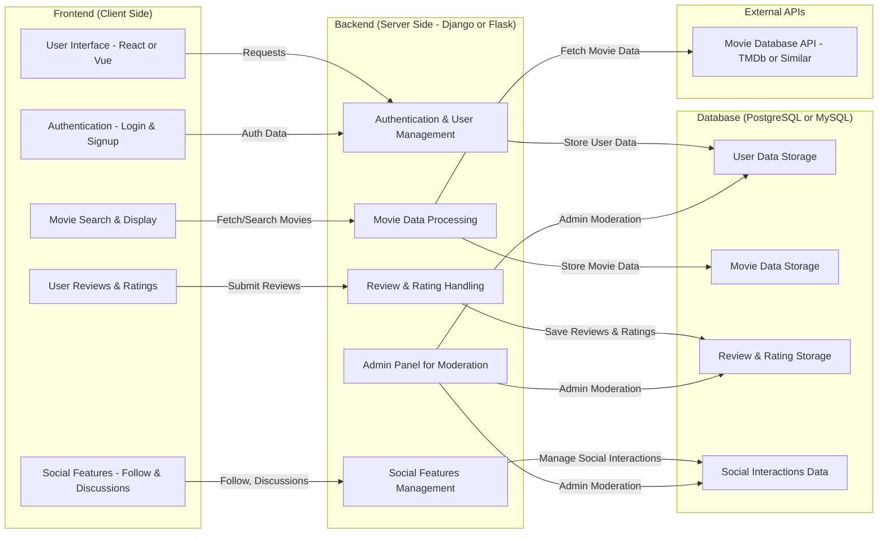

```mermaid
graph LR;

    subgraph "Frontend (Client Side)"
        A1[User Interface - React or Vue]
        A2[Authentication - Login & Signup]
        A3[Movie Search & Display]
        A4[User Reviews & Ratings]
        A5[Social Features - Follow & Discussions]
    end

    subgraph "Backend (Server Side - Django or Flask)"
        B1[Authentication & User Management]
        B2[Movie Data Processing]
        B3[Review & Rating Handling]
        B4[Social Features Management]
        B5[Admin Panel for Moderation]
    end

    subgraph "Database (PostgreSQL or MySQL)"
        C1[User Data Storage]
        C2[Movie Data Storage]
        C3[Review & Rating Storage]
        C4[Social Interactions Data]
    end

    subgraph "External APIs"
        D1[Movie Database API - TMDb or Similar]
    end

    %% Connections
    A1 -->|Requests| B1
    A2 -->|Auth Data| B1
    A3 -->|Fetch/Search Movies| B2
    A4 -->|Submit Reviews| B3
    A5 -->|Follow, Discussions| B4

    B1 -->|Store User Data| C1
    B2 -->|Store Movie Data| C2
    B3 -->|Save Reviews & Ratings| C3
    B4 -->|Manage Social Interactions| C4

    B2 -->|Fetch Movie Data| D1

    B5 -->|Admin Moderation| C1 & C3 & C4
```
