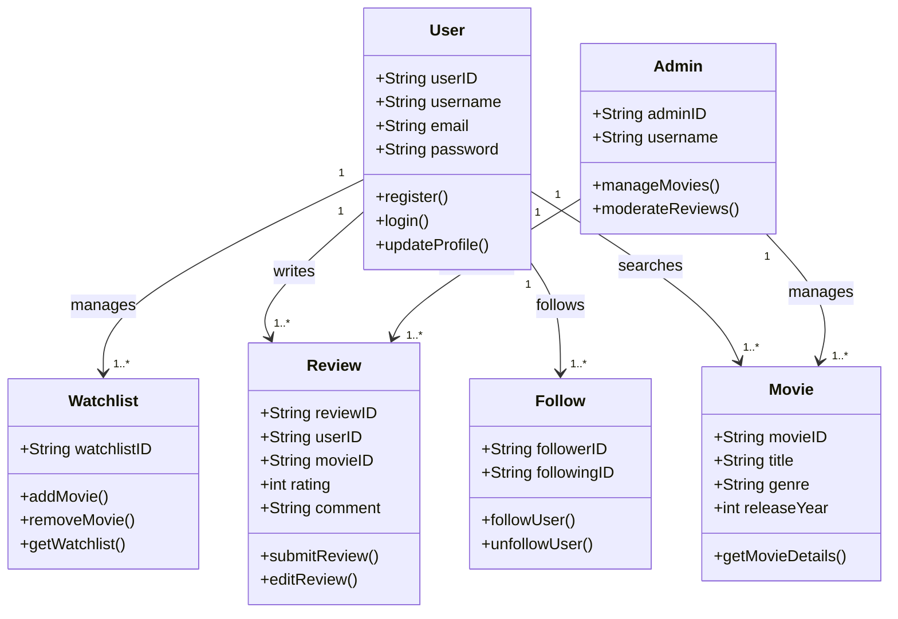

```mermaid
classDiagram
    class User {
        +String userID
        +String username
        +String email
        +String password
        +register()
        +login()
        +updateProfile()
    }

    class Movie {
        +String movieID
        +String title
        +String genre
        +int releaseYear
        +getMovieDetails()
    }

    class Watchlist {
        +String watchlistID
        +addMovie()
        +removeMovie()
        +getWatchlist()
    }

    class Review {
        +String reviewID
        +String userID
        +String movieID
        +int rating
        +String comment
        +submitReview()
        +editReview()
    }

    class Follow {
        +String followerID
        +String followingID
        +followUser()
        +unfollowUser()
    }

    class Admin {
        +String adminID
        +String username
        +manageMovies()
        +moderateReviews()
    }

    User "1" --> "1..*" Watchlist : manages
    User "1" --> "1..*" Review : writes
    User "1" --> "1..*" Follow : follows
    User "1" --> "1..*" Movie : searches
    Admin "1" --> "1..*" Movie : manages
    Admin "1" --> "1..*" Review : moderates
```
