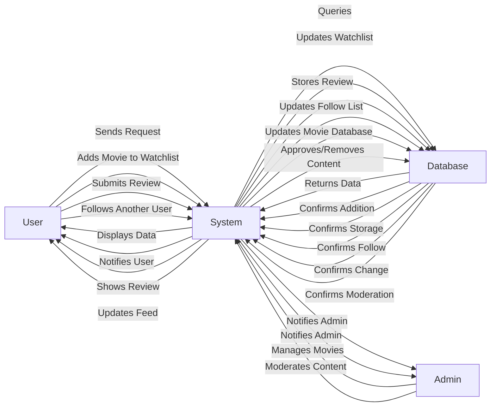

```mermaid
graph LR;
    User -- Sends Request --> System;
    System -- Queries --> Database;
    Database -- Returns Data --> System;
    System -- Displays Data --> User;

    User -- Adds Movie to Watchlist --> System;
    System -- Updates Watchlist --> Database;
    Database -- Confirms Addition --> System;
    System -- Notifies User --> User;

    User -- Submits Review --> System;
    System -- Stores Review --> Database;
    Database -- Confirms Storage --> System;
    System -- Shows Review --> User;

    User -- Follows Another User --> System;
    System -- Updates Follow List --> Database;
    Database -- Confirms Follow --> System;
    System -- Updates Feed --> User;

    Admin -- Manages Movies --> System;
    System -- Updates Movie Database --> Database;
    Database -- Confirms Change --> System;
    System -- Notifies Admin --> Admin;

    Admin -- Moderates Content --> System;
    System -- Approves/Removes Content --> Database;
    Database -- Confirms Moderation --> System;
    System -- Notifies Admin --> Admin;
```
