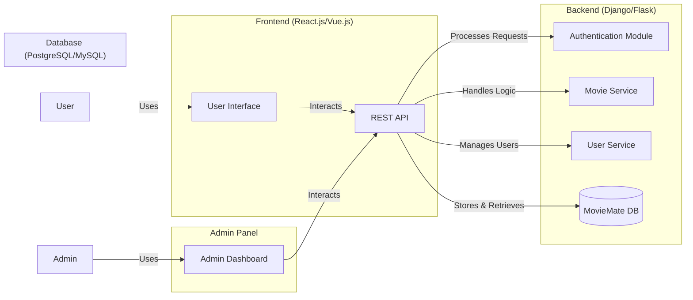

```mermaid
graph LR
    subgraph "Frontend (React.js/Vue.js)"
        UI[User Interface] -->|Interacts| API
    end

    subgraph "Backend (Django/Flask)"
        API[REST API] -->|Processes Requests| Auth[Authentication Module]
        API -->|Handles Logic| MovieService[Movie Service]
        API -->|Manages Users| UserService[User Service]
        API -->|Stores & Retrieves| Database
    end

    subgraph "Database (PostgreSQL/MySQL)"
        Database[(MovieMate DB)]
    end

    subgraph "Admin Panel"
        AdminUI[Admin Dashboard] -->|Interacts| API
    end

    User -->|Uses| UI
    Admin -->|Uses| AdminUI
```
