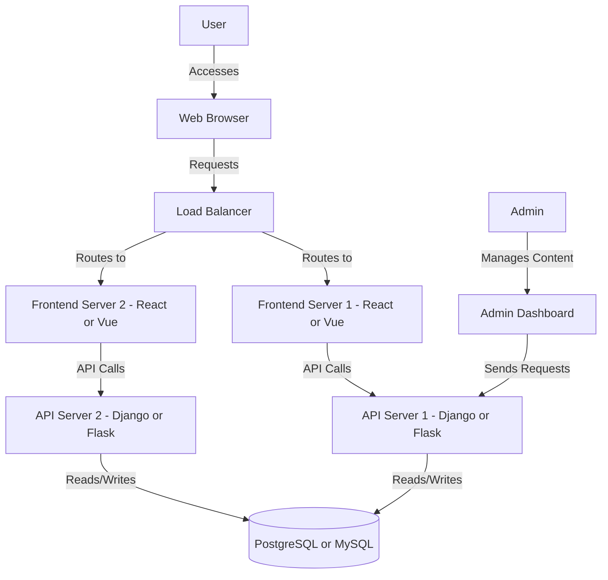

```mermaid
graph TD
    User[User] -->|Accesses| Browser[Web Browser]
    Browser -->|Requests| LoadBalancer[Load Balancer]

    LoadBalancer -->|Routes to| Frontend1[Frontend Server 1 - React or Vue]
    LoadBalancer -->|Routes to| Frontend2[Frontend Server 2 - React or Vue]

    Frontend1 -->|API Calls| API1[API Server 1 - Django or Flask]
    Frontend2 -->|API Calls| API2[API Server 2 - Django or Flask]

    API1 -->|Reads/Writes| Database[(PostgreSQL or MySQL)]
    API2 -->|Reads/Writes| Database

    Admin[Admin] -->|Manages Content| AdminPanel[Admin Dashboard]
    AdminPanel -->|Sends Requests| API1
```
