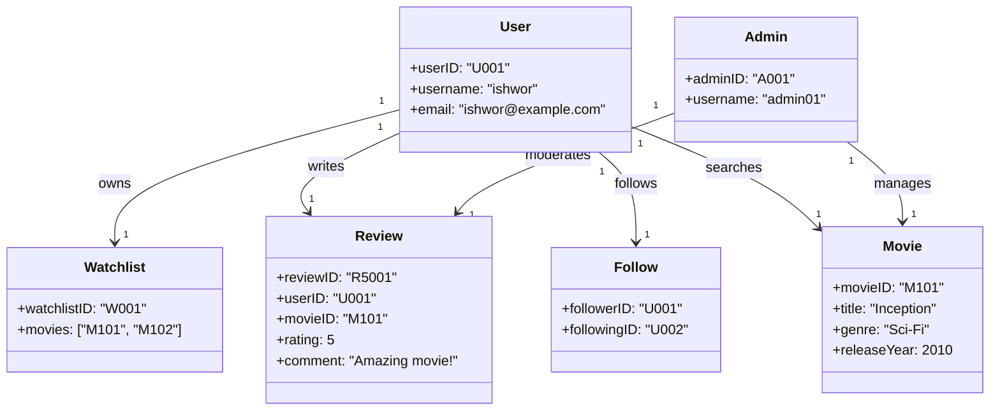

```mermaid
classDiagram
    class User {
        +userID: "U001"
        +username: "ishwor"
        +email: "ishwor@example.com"
    }

    class Movie {
        +movieID: "M101"
        +title: "Inception"
        +genre: "Sci-Fi"
        +releaseYear: 2010
    }

    class Watchlist {
        +watchlistID: "W001"
        +movies: ["M101", "M102"]
    }

    class Review {
        +reviewID: "R5001"
        +userID: "U001"
        +movieID: "M101"
        +rating: 5
        +comment: "Amazing movie!"
    }

    class Follow {
        +followerID: "U001"
        +followingID: "U002"
    }

    class Admin {
        +adminID: "A001"
        +username: "admin01"
    }

    User "1" --> "1" Watchlist : owns
    User "1" --> "1" Review : writes
    User "1" --> "1" Follow : follows
    User "1" --> "1" Movie : searches
    Admin "1" --> "1" Movie : manages
    Admin "1" --> "1" Review : moderates
```
