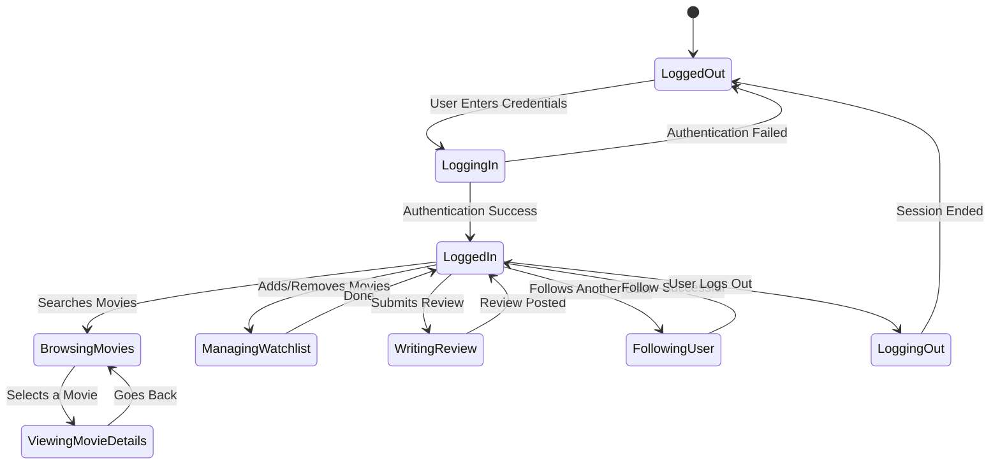

```mermaid
stateDiagram-v2
    [*] --> LoggedOut
    LoggedOut --> LoggingIn: User Enters Credentials
    LoggingIn --> LoggedIn: Authentication Success
    LoggingIn --> LoggedOut: Authentication Failed

    LoggedIn --> BrowsingMovies: Searches Movies
    BrowsingMovies --> ViewingMovieDetails: Selects a Movie
    ViewingMovieDetails --> BrowsingMovies: Goes Back

    LoggedIn --> ManagingWatchlist: Adds/Removes Movies
    ManagingWatchlist --> LoggedIn: Done

    LoggedIn --> WritingReview: Submits Review
    WritingReview --> LoggedIn: Review Posted

    LoggedIn --> FollowingUser: Follows Another User
    FollowingUser --> LoggedIn: Follow Successful

    LoggedIn --> LoggingOut: User Logs Out
    LoggingOut --> LoggedOut: Session Ended
```
